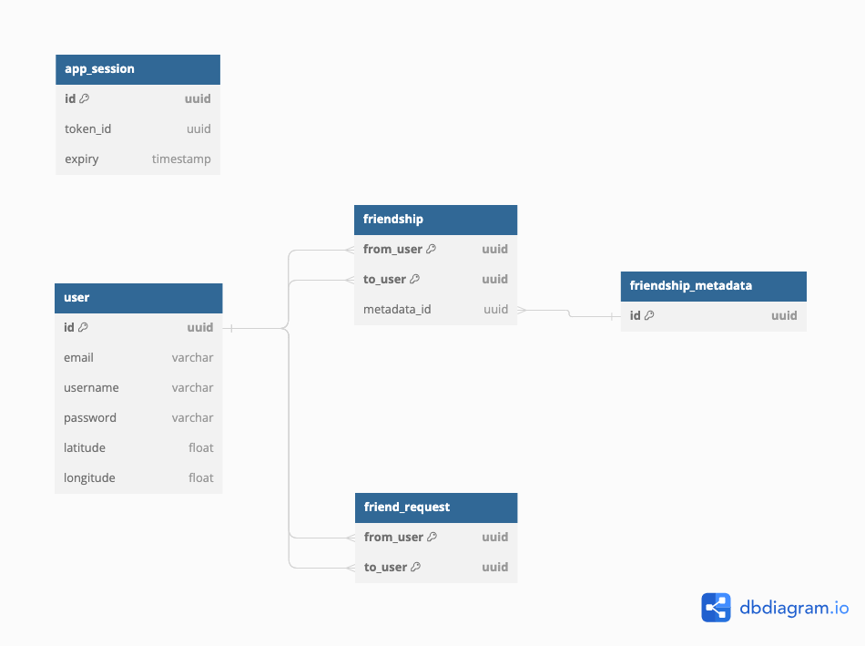

# SmallWorld Server

Server-side codebase for SmallWorld, whose project overview and screenshots can be found  [the smallworld base repo.](https://github.com/germaindudek/smallworld) This back-end is built with the mobile app in mind and thus it's endpoints match the functionality required by it's different features.

## Prerequisites

- Yarn
- Docker (if using local database instance)

## Getting Started

To run the server locally for development purposes:

1. Clone the repository
2. Navigate to its' root directory
3. Build the docker image:
```bash
docker build -t smallworld-db-image .
```
4. Run a container from the image just created
```bash
docker run -d --name smallworld-db -p 5432:5432 smallworld-db-image
```
5. Any time you restart your computer, docker will stop your container. To get it running again, run:
```bash
docker start smallworld-db
```
6. Start the server in local mode
```bash
yarn start:local
```

## Technology Stack

- **NestJS** on top of express for back-end architecture
- **passport and bcrypt** for authentication
- **nestjs/config** for configuration management
- **nestjs/schedule** for task scheduling
- **typeorm** for object relational mapping
- **class-validator** for validation
- **pino** for logging

## Schema



## File Structure

```
-- src
|   |-- config          # Configuration schema
|   |-- modules         # NestJs Modules
```

## Architecture

#### Overview

The application consists of three layers: the controller layer, the service layer, and the repository layer. The controller layer handles routing and input validation, the service layer handles the core business logic of the application, and the repository layer acts as a layer of abstraction between the service layer and the database.

Despite adding some overhead over more rudimentary frameworks like ExpressJs, the main advantage with NestJs is that it provides an explicit architecture, making our code more predictable by outlining where certain types of functionality should reside. It also provides dependency injection out of the box, has support for various decorators which make it easy to add functionality like validation and authentication to routes or modules in a declarative and readable manner, and has many optional modules that can be added to it to extend it's core functionality.

#### Authentication

When a user authenticates, whether it be through signing in or signing up, a session is created for them and they are given an access token and a refresh token. Once their access token expires after a short time, they can refresh their tokens with the refresh token.

The access token's payload contians the standard fields along with the session id:

```json
{
  "sub": "392c1dbc-6442-4afe-8f9a-14f332db156b",        // user id
  "sessionid": "11a1aeb3-0b58-4558-be55-315dfa0ad759",  // session id
  "iat": 123456,                                        // issued at
  "exp": 123456                                         // expiry
}
```

And the refresh token contains all of those and an additional field containing the token id:

```json
{
  "sub": "392c1dbc-6442-4afe-8f9a-14f332db156b",        // user id
  "sessionid": "11a1aeb3-0b58-4558-be55-315dfa0ad759",  // session id
  "jti": "cf05f07b-8bef-4429-979e-ffcedc410a50",        // token id
  "iat": 123456,                                        // issued at
  "exp": 123456                                         // expiry
}
```

The user must provide the access token as a bearer token on the `authorization` when making any requests to any endpoint which requires the user to be authenticated. All such endpoints are annotated with `@UseGuards(AccessTokenGuard)` which routes all those requests through the `AccessTokenStrategy` passport strategy to validate authentication. The `passport-jwt` strategy validates the tokens signature for us and inside the `validate` method we perform an additional check that that the session associated with that token (by the `sessionid` field) has not been compromised.

Once a user's access token expires they have to use their refresh token to get a new one. Every time the tokens are refreshed a new token pair is created and the new refresh token is assigned a *new id* and expiration date which is also updated in the `app_session` table. This is done through the `auth/refresh-tokens` endpoint which is guarded with the `RefreshTokenStrategy`. As with the `AccessTokenStrategy`, the `RefreshTokenStrategy` validates the tokens signature for us, but it's `validate` method is slightly more complicated. In it we perform these checks:

1. We check that the session is valid by making sure that the `sessionid` exists in the `app_session` table. If there is no entry it means either the session has expired naturally or that the sessions been invalidated and removed from the table after it's been suspected to be compromised. If no entry exists token refresh is denied and the user will have to re-authenticate.
2. If the session is valid we  compare the id of the refresh token provided by the user to the one in the session's table entry. If they are the same that means that the token they've given us is the one we're expecting and we can give them a new pair of tokens and update the `app_session` table. If it is different that means an old token is being used. This could mean one of two things:
   - the request is being made by an attacker who has stolen one of the users old refresh tokens
   - the request is being made by the real user but their refresh token is no longer valid because an attacker has stolen it and has already used it to obtain a new access token

It is impossible to know which of those cases is true but in either case the session has been compromised and it is tagged as such with the `SessionService` and the refresh token request is denied. The `SessionService` retains a record of any compromised session until any access tokens associated with that session have undoubtedly expired.

In short, any refresh token can be used once and only once, and we can enforce this by assigning every new refresh token a new id on every refresh and always keeping a reference to the latest id in the `app_session` table. No legitimate client of the application will try to reuse a refresh token twice, so any attempt to reuse a refresh token is a clear sign that the session has been compromised. 

#### Repositories

Rather than use the repositories provided out of the box by `typeorm`, we create our own repository for every entity in our database, which wraps around `typeorm`'s repository. We do this to:

- Decouple our services from typeorm such that we can more easily change the underlying ORM in the future if needed
- Be more explicit with regards to the interactions allowed with a particular table
- Allow for the addition of methods that don't exist within `typeorm` repositories, which may involve a series of calls that would cloud the business logic inside `Service` methods

All repositories follow this general structure:

```typescript
@Injectable()
export class FriendRequestRepository {
  constructor(
    @InjectRepository(FriendRequestEntity)
    private repository: Repository<FriendRequestEntity>,
  ) {}
  
  ...

  async add(friendRequest: FriendRequestEntity): Promise<FriendRequestEntity> {
    return this.repository.save(friendRequest);
  }

  ...
}
```

##### Validation

All DTO's are validated with `class-validator` decorators within the DTO declaration itself. The below code from `src/main.ts` ensures that all route handler parameters are passed through `ValidationPipe`, a pipe provided by nestjs that validates all DTO's with `class-validator` under the hood.

```typescript
app.useGlobalPipes(
    new ValidationPipe({
      disableErrorMessages: process.env.STAGE == Stages.PROD,
    }),
);
```

Note that since TypeScript does not store metadata about interfaces they cannot be used for DTO's. All DTO's are implemented as classes.

## Modules

##### auth

The auth module handles all `/auth` routes through the `AuthController`: signing in and out, signing up, refreshing tokens, and validation of email and username for the sign up flow of the mobile app. It depends heavily on the `UserService` to perform its tasks. It does not have it's own database table or repository.

##### friends

The friends module handles all `/friends` routes, sending requests, accepting/refusing requests, getting all requests, as well as methods useful to other services like getting the friendship status between two users. It maintains information on user friendships through the `frienship` and `friensdhip_metadata` database tables.

##### location

The location module handles all `/location` routes: updating the users location, getting all their friends locations, getting their own location. The location module does not own its own table, as user location data is stored within the user table. As such, it relies heavily on `UserService`.

##### profile

The profile module handles all `/profile` routes, assembling all the data necessary for displaying a users profile on the mobile app. It does not own it's own database table, it constructs the data by aggregating data from the `UserService` and the `FriendService`.

##### search

The search module handles all `/search` routes. It does not own it's own table, as it depends on `UserService` to search users.

##### session

The session module does not handle any routes. Instead, it provides `SessionService` which exposes methods for managing user sessions and maintains information on compromised user sessions. It is used exlusively by the auth module.

##### user

The user service does not handle any routes. It provides `UserService` which exposes methods for managing users and their data through the `user` table: searching, getting by username or email, updating location, etc.. It is used by many of the modules above.

## Licence

 Smallworld is licenced under the Creative Commons Attribution-NonCommercial-ShareAlike (CC BY-NC-SA) 4.0 International License. To view a copy of this licence, visit https://creativecommons.org/licenses/by-nc-sa/4.0/